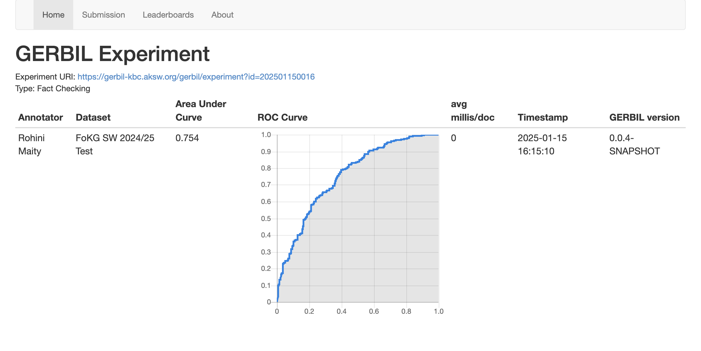

# Fact-Checking Engine 

## Instructions

Follow these steps to set up and run the fact-checking engine:

1. Download the Zip File:
   - Go to the repository on GitHub: https://github.com/LABlidh/kn_mini_project
   - Click on the "Code" button
   - Select "Download ZIP"

2. Unzip the folder.

3. Change the test data path:
   - Open the Jupyter Notebook file (fact_checker.ipynb) in the unzipped folder using an IDE of your choice. We recommend Visual Studio Code.
   - In the first cell, you will find a constant that holds the path to a test data file. Change this path accordingly. We recommend placing the test data file in the data folder within the unzipped directory and using a relative path.

4. Use a pretrained model or train a new one:
   - Faster computation with pretrained model: If you want faster computation, the script will use the pretrained model (transE_model.pkl) if it exists in the same directory.
   - Train the model yourself: If you want to train the model from scratch, delete the "transE_model.pkl" and run the notebook.

5. Open the terminal in the unzipped folder.

6. Install Python and pip (if not already installed)(we used Python 3.10 and pip 24.2 or Python 3.12.0 and pip 23.2.1):
   - Python: Download and install from https://www.python.org/downloads/
   - pip: Usually comes with Python. If not, follow instructions from https://pip.pypa.io/en/stable/installation/

7. Create a virtual environment: 
   ```bash
    python -m venv venv
    ```

8. Activate the virtual environment:
   - On MacOS/Linux, run:
     ```bash
     source venv/bin/activate
     ```
   - On Windows, run:
     ```bash
     .\venv\Scripts\activate
     ```

9. Install dependencies:
     ```bash
     pip install -r requirements.txt
     ```
     If there are errors, these are the libraries needed: 
      ```bash
      pip install jupyter rdflib pandas numpy torch scikit-learn pykeen
      ```
   
   (If using Visual Studio Code Terminal, we recommend restarting it and activate the environment before proceeding to the next step.)

10. Run all cells in a Jupyter Notebook. There are different ways to do this, for example, from the terminal: 
      ```bash 
      jupyter nbconvert --to notebook --execute fact_checker.ipynb --output fact_checker.ipynb 
      ```
      This might take some minutes; if it takes too long, consider decreasing the number of epochs (variable: num_epochs).

11. The result file is then saved in the unzipped folder as "result.ttl".

## Result
The result of the provdided test data was evaluated by the GERBIL platform. It atchived a Area Under Curve (AUC) of *0,754* for the submited ROC curve. So the criteria of achieving a Roc AUC above 0.6 in GERBIL on the test dataset was readed. See: https://gerbil-kbc.aksw.org/gerbil/experiment?id=202501150016
<br>
Submitted in GERBIL with these credentials:<br>
GERBIL <br>
Rohini Maity <br>
rohini.maity@outlook.com <br> 



## Contact
rohini.maity@outlook.com <br>
lea.blidh@googlemail.com

## Group 
Rohini Maity <br>
Lea Alexandra Blidh <br>
Akshaya Nair
